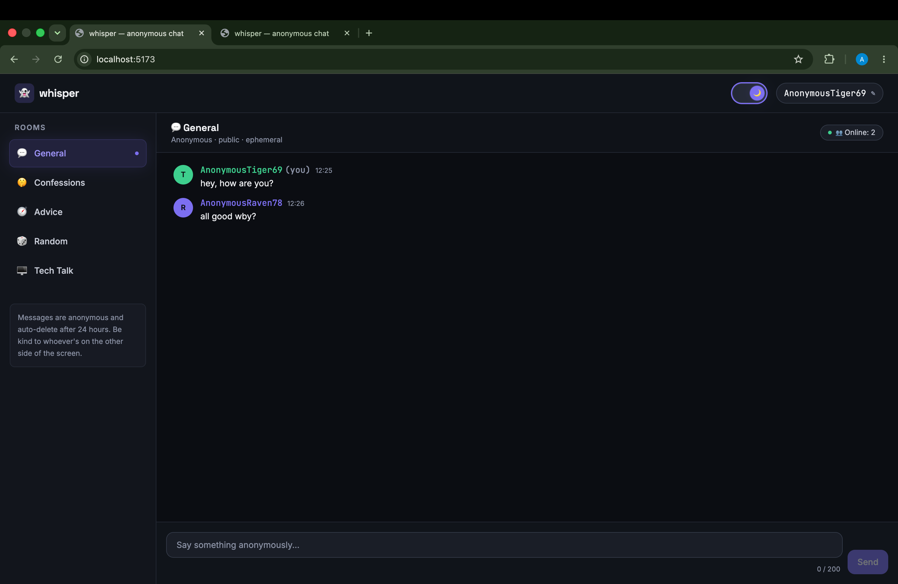
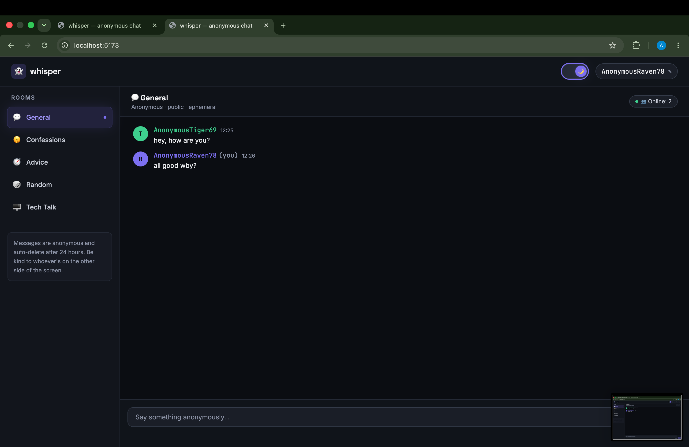
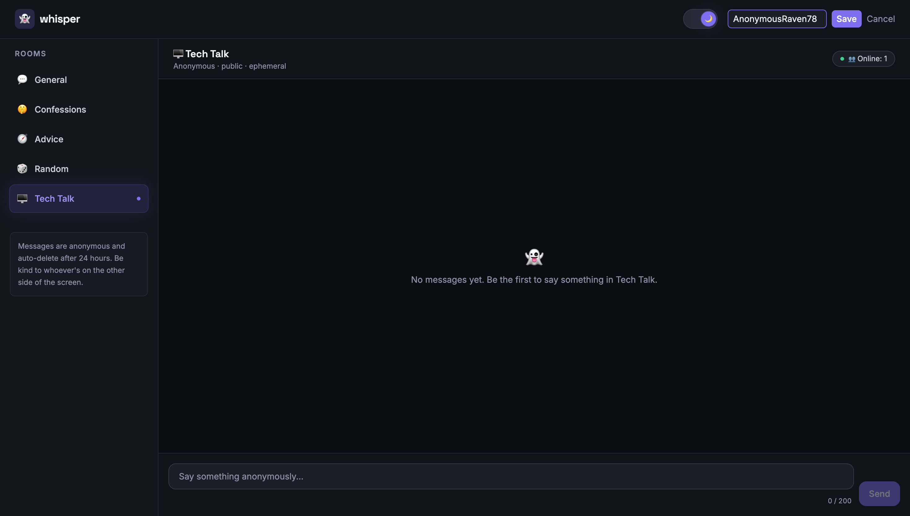

# whisper — Anonymous Multi-User Chat System

**Repo:** `DeviX-task1`

A real-time, anonymous, multi-room chat app. No sign-up, no login — open the
site and you're instantly assigned a random anonymous handle, ready to talk
in one of five public rooms.

## Tech stack

- React 18 + Vite
- Tailwind CSS (dark mode by default, toggle to light)
- Firebase Realtime Database (live messages + presence)

## Features

- ✅ Anonymous login — random name like `AnonymousPanda42`, generated per session
- ✅ 5 public rooms — General, Confessions, Advice, Random, Tech Talk
- ✅ Real-time messaging via Firebase Realtime Database
- ✅ Message timestamps (`10:45 PM` style)
- ✅ Auto-scroll to the latest message
- ✅ Live online user count per room (Firebase presence + `onDisconnect`)
- ✅ 200-character limit with a live counter, blocks empty/over-limit sends
- ✅ Basic profanity filter (censors or blocks blocked words)
- ✅ Change your username once per session
- ✅ Messages auto-expire after 24 hours (filtered client-side, opportunistically
  cleaned up from the database)
- ✅ Responsive layout — mobile, tablet, laptop, desktop
- ✅ Dark mode by default with a toggle
## Screenshots

**Main chat view**


**Room sidebar**


**Username editor**


## Getting started

### 1. Install dependencies

```bash
npm install
```

### 2. Create a Firebase project

1. Go to the [Firebase console](https://console.firebase.google.com/) → **Add project**.
2. In your project, go to **Build → Realtime Database → Create Database**.
   Start in **test mode** for local development (see security rules below
   before going to production).
3. Go to **Project settings → General → Your apps → Add app → Web app**.
4. Copy the config values it gives you.

### 3. Configure environment variables

```bash
cp .env.example .env.local
```

Fill in `.env.local` with the values from your Firebase web app config:

```
VITE_FIREBASE_API_KEY=...
VITE_FIREBASE_AUTH_DOMAIN=...
VITE_FIREBASE_DATABASE_URL=...
VITE_FIREBASE_PROJECT_ID=...
VITE_FIREBASE_STORAGE_BUCKET=...
VITE_FIREBASE_MESSAGING_SENDER_ID=...
VITE_FIREBASE_APP_ID=...
```

### 4. Run it

```bash
npm run dev
```

Open the printed local URL. Open it in two tabs (or two browsers) to see
real-time messaging and the online counter in action.

### 5. (Recommended) lock down your database rules

`firebase.rules.json` in this repo has a starting point — open/write access
scoped to `rooms/*/messages` and `presence/*`, with basic validation on
message shape and length. Paste it into **Realtime Database → Rules** in the
Firebase console before deploying publicly, and tighten further as needed
(e.g. rate limiting requires Cloud Functions, which are out of scope here).

## Project structure

```
src/
├── components/
│   ├── Navbar.jsx          # logo, dark mode toggle, username + editor
│   ├── Sidebar.jsx         # room switcher
│   ├── ChatRoom.jsx        # subscribes to messages + presence, auto-scroll
│   ├── Message.jsx         # single message bubble with timestamp
│   ├── MessageInput.jsx    # input, char counter, validation, profanity filter
│   ├── UserCount.jsx       # online users badge
│   └── DarkModeToggle.jsx
├── context/
│   └── ChatContext.jsx     # username, session id, current room, theme
├── firebase/
│   └── firebase.js         # Firebase init, reads config from env vars
├── utils/
│   ├── usernameGenerator.js
│   └── profanityFilter.js
├── App.jsx
└── main.jsx
```

## Notes on the 24-hour auto-delete

Realtime Database alone can't run scheduled server-side jobs without Cloud
Functions (a paid/blaze-plan feature). This project takes a pragmatic
two-layer approach:

1. **Client-side filter** — any message older than 24 hours is hidden from
   the UI immediately, regardless of whether it's still in the database.
2. **Opportunistic cleanup** — whenever a client reads a room's messages, it
   deletes any it finds older than 24 hours. Because Realtime DB writes are
   cheap and idempotent, this keeps the database reasonably tidy without a
   backend, though it isn't as precise as a real scheduled job.

For a production deployment, swap this for a Cloud Function on a nightly
schedule using `admin.database()` to sweep old messages server-side.

## Deploying

Any static host works since this is a Vite SPA:

```bash
npm run build
```

Deploy the `dist/` folder to Vercel, Netlify, Firebase Hosting, or GitHub Pages.
Remember to set the same environment variables in your host's dashboard.
